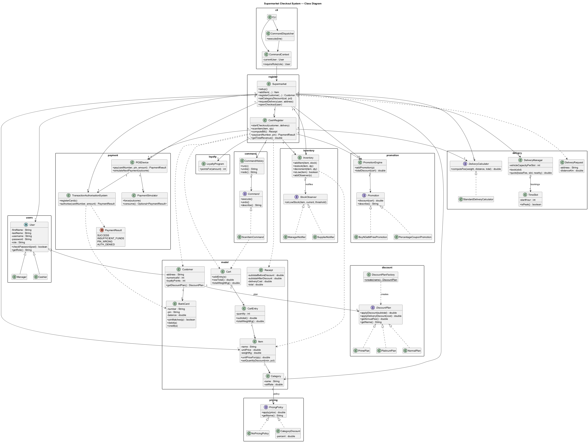
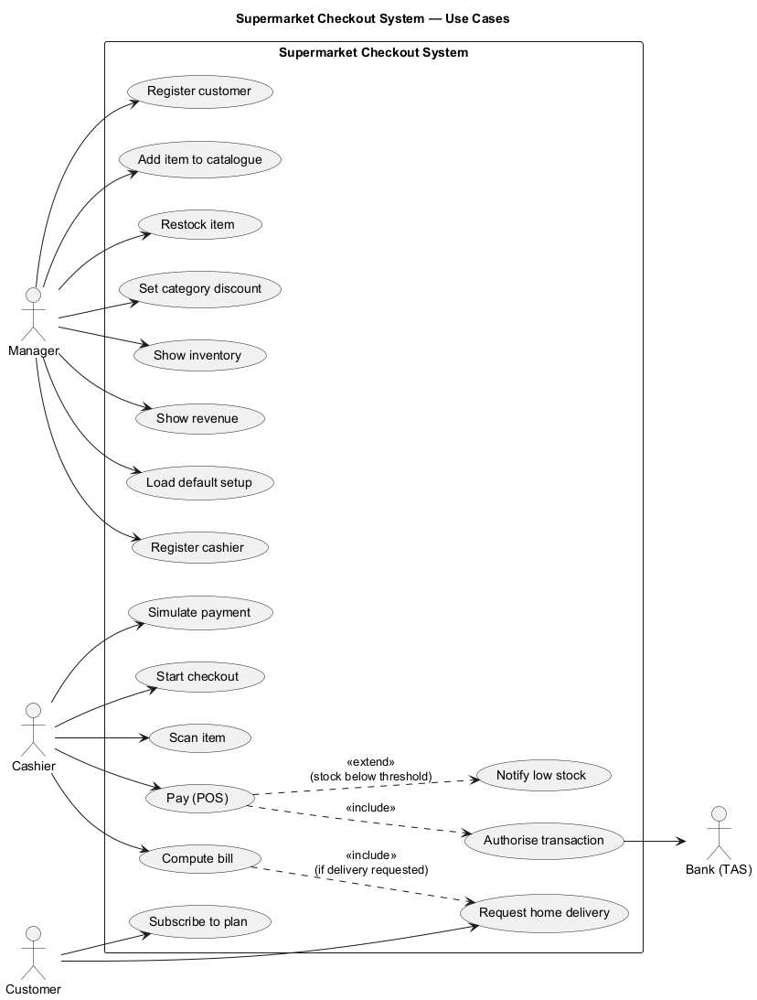
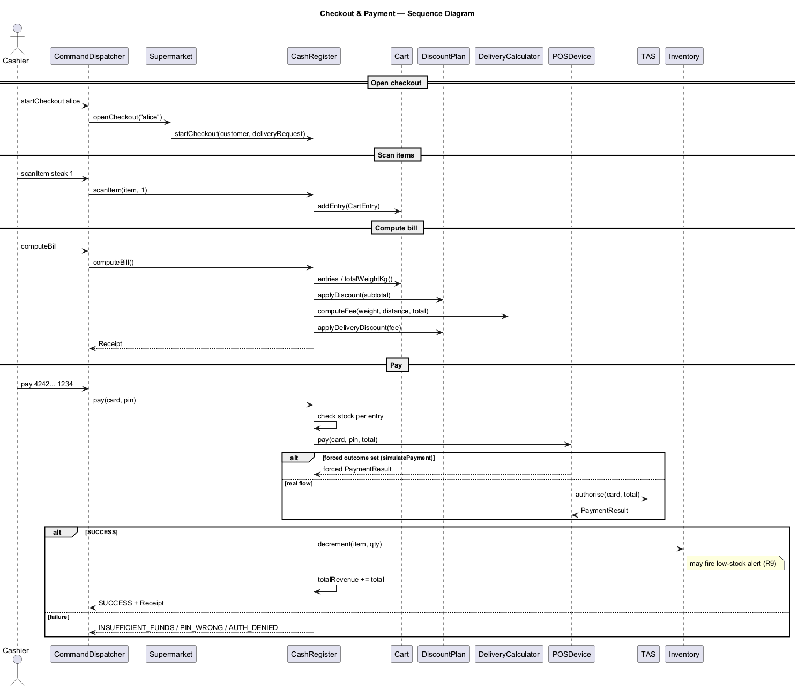
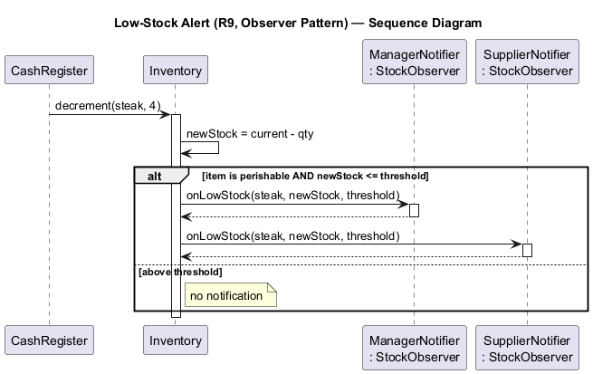

# Supermarket Checkout System — Project Report

**Course:** Software Engineering Project 2026 — CentraleSupélec
**Language:** Java 17+ (built and tested on JDK 21), Maven, JUnit 5
**Repository:** https://github.com/enzovendramin/supermarket-checkout

---

## 1. Overview

This project implements a supermarket checkout system in Java with a
command-line user interface (CLUI). It processes purchases, computes bills
combining customer discount plans and category pricing policies, handles bank
card payments through a POS terminal and the bank's Transaction Authorisation
System (TAS), manages a live inventory with real-time low-stock alerts, and
supports home delivery with weight/distance-based charging and smart logistics
(time slots, anti-overbooking, dynamic pricing).

The system is organised in layered packages:

```
supermarket
├── model       domain entities (Item, Category, Cart, CartEntry, BankCard, Customer, Receipt)
├── users       User (abstract) + Manager, Cashier
├── discount    DiscountPlan strategy + Normal/Prime/Platinum + factory
├── pricing     PricingPolicy strategy + NoPricingPolicy, CategoryDiscount
├── inventory   Inventory + StockObserver + Manager/Supplier notifiers (Observer)
├── payment     POSDevice, TransactionAuthorisationSystem, PaymentSimulator, PaymentResult
├── delivery    DeliveryCalculator strategy + DeliveryRequest, TimeSlot, DeliveryManager
├── promotion   Promotion strategy + BuyNGetMFree, Coupon, PromotionEngine  (extension)
├── command     Command + ScanItemCommand + CommandHistory (undo/redo)       (extension)
├── loyalty     LoyaltyProgram                                               (extension)
├── register    CashRegister (checkout orchestration) + Supermarket (system core)
├── cli         CLI, CommandContext, CommandDispatcher (the CLUI)
└── gui         CheckoutApp + DemoData (JavaFX desktop UI)                    (extension)
```

---

## 2. Design Decisions — How Requirements Shaped the Code

| Requirement | Design impact |
|-------------|---------------|
| **R1, R2, R2b** — purchases are sets of bought items in mandatory categories | `Cart` aggregates `CartEntry` (item + quantity); `Category` is a first-class entity so policies can attach to it. |
| **R3** — each item is priced, the price *may depend on quantity* | `Item` holds a base unit price and an optional bulk rule; `Item.unitPriceFor(qty)` applies a per-unit discount once a quantity threshold is reached (CLUI `setQuantityDiscount`). |
| **R4** — payment by bank card | `POSDevice` + `TransactionAuthorisationSystem` model the POS↔bank protocol; `BankCard` carries number, PIN and balance. |
| **R5 / R5b** — extensible discount plans with annual fees | **Strategy** interface `DiscountPlan` (with `getAnnualFee()`) plus a **Factory** to create plans by name at runtime. `subscribeToPlan` charges the fee immediately (normal €0, prime €50, platinum €200) — debited from the card and added to revenue. |
| **R6 / R6b** — extensible per-category pricing policies | **Strategy** interface `PricingPolicy` attached to each `Category`; new categories/policies plug in freely. |
| **R7, R8, R8b** — home delivery with weight/distance charging and plan discounts | `DeliveryCalculator` **Strategy** computes the fee; the customer's `DiscountPlan` reduces/waives it. |
| **R9** — live inventory and low-stock alerts | **Observer** pattern: `Inventory` notifies `StockObserver`s when a perishable item drops to/below its threshold. |
| **R10** — 2-hour slots, anti-overbooking, dynamic pricing | `TimeSlot` + `DeliveryManager` track capacity per window and compute peak/eco price multipliers; exposed via the CLUI commands `bookDeliverySlot` and `quoteDeliverySlot`. |
| **§2.3** — customer has a unique numerical ID | `Customer` carries an auto-incremented `numericalId` assigned at registration, in addition to the login username. |
| **Part 2** — CLUI with error handling | Three-class CLI layer with a quote-aware tokenizer, role-based permissions, and uniform error reporting that never crashes the interpreter. |

---

## 3. Design Patterns Used

| Pattern | Where | Problem it solves |
|---------|-------|-------------------|
| **Strategy** | `DiscountPlan` → Normal/Prime/Platinum | Swap discount behaviour per customer without conditionals; satisfies the *extensibility* requirement R5b. |
| **Strategy** | `PricingPolicy` → NoPricingPolicy/CategoryDiscount | Per-category pricing that can be changed/added at runtime (R6b). |
| **Strategy** | `DeliveryCalculator` → StandardDeliveryCalculator | The delivery charging scheme can be replaced without touching the bill logic (R8). |
| **Factory** | `DiscountPlanFactory` | Creates a plan from its string name (used by `subscribeToPlan`), centralising the mapping and isolating the rest of the system from concrete plan classes. |
| **Observer** | `Inventory` → `StockObserver` (`ManagerNotifier`, `SupplierNotifier`) | Decouples stock bookkeeping from who reacts to low stock; new listeners can subscribe without modifying `Inventory` (R9, explicitly required). |
| **Strategy** | `Promotion` → `BuyNGetMFreePromotion`, `PercentageCouponPromotion` (extension) | Pluggable store promotions aggregated by `PromotionEngine`; new offers need no checkout change. |
| **Command** | `Command` → `ScanItemCommand` + `CommandHistory` (extension) | Makes checkout actions reversible, enabling `undo`/`redo` of a mis-scan. |
| **Facade** | `TransactionAuthorisationSystem` | Hides the banking authorisation protocol behind a single `authorise(card, amount)` method. |
| **(Mediator-like)** | `CashRegister` / `Supermarket` | `Supermarket` is the system core wiring components together; `CashRegister` orchestrates a checkout session across cart, plan, delivery, POS and inventory. |

---

## 4. Bill Computation

`CashRegister.computeBill()` applies pricing in this order (spec §2.4):

1. **Quantity-based unit price** (R3): each line uses `Item.unitPriceFor(qty)`,
   applying any bulk discount once the quantity threshold is reached.
2. **Per-item category policy** (R6): the unit price is passed through its
   `Category.pricingPolicy` (e.g. −10% on fruit-and-vegetables).
3. **Promotions** (extension): `PromotionEngine` discounts (coupons, buy-N-get-M)
   are subtracted from the items subtotal.
4. **Customer discount plan** (R5): the result is passed through the customer's
   `DiscountPlan` (e.g. Prime −20% only if subtotal ≥ €50; Platinum −30% always).
5. **VAT** (extension): per-category tax computed on the net line prices.
6. **Delivery fee** (R8/R8b): if a delivery was requested, the
   `DeliveryCalculator` computes the fee from total weight, distance and order
   value, then the plan's `applyDeliveryDiscount` reduces it (Prime 50%,
   Platinum free).

`total = items_after_plan + VAT + delivery_after_plan`. (Promotions and VAT
default to zero, so the core requirements behave exactly as specified.)

---

## 5. UML Diagrams

The diagrams are provided as PlantUML sources (and rendered PNGs) in `docs/uml/`.

### 5.1 Class diagram (mandatory)

All packages, the three Strategy hierarchies (discount, pricing, delivery), the
Observer hierarchy (inventory) and the orchestration core (register, cli).



### 5.2 Use-case diagram

Use cases for the Manager, Cashier, Customer and the Bank (TAS).



### 5.3 Sequence — checkout & payment

Checkout + bill + payment flow, including the forced/real payment branch and the
post-success inventory decrement.



### 5.4 Sequence — low-stock alert (Observer, R9)

The Observer notification fired when a perishable item drops to/below its
threshold.



> **Rendering note:** the PNGs above were generated from the `.puml` sources with
> PlantUML. To regenerate them, run `java -jar plantuml.jar docs/uml/*.puml`, or
> open the `.puml` files with the *PlantUML* extension in VS Code.

---

## 6. Test Scenarios (mandatory description)

Four scenario files are provided and run via `runTest <file>` in the CLUI.

### `testScenario1.txt`
End-to-end "happy path" exercising the core requirements:
1. Manager bootstraps the system (`setup`) and extends the catalogue.
2. Category-level pricing policy: −10% on *fruit-and-vegetables* (R6).
3. Customer subscribes to *prime* (R5) and requests home delivery (R7).
4. Cashier opens a checkout with a mixed cart of all three mandatory categories (R2b).
5. Subscribing to prime **charges the €50 annual fee** immediately (R5).
6. `computeBill` combines the category discount and the plan; delivery fee is
   halved by the prime plan (R8b). **Result: items €23.24 + delivery €7.50 = €30.74.**
   (Prime's 20% does *not* apply here because the subtotal is below €50 — correct per R5.)
7. First payment fails (`INSUFFICIENT_FUNDS`), retry succeeds (R4).
8. A second checkout buys 4 steaks (€50 → prime −20% = €40) and drives steak
   stock to 0, **firing the R9 low-stock alert** (Observer).
9. Manager inspects `showInventory` (steak flagged `[LOW STOCK]`) and
   `showRevenue`: two sales €70.74 + the €50 prime fee = **€120.74**.

### `testScenario2.txt`
Complementary scenario covering paths scenario 1 does not:
1. **Platinum** plan: −30% on items and **free delivery** (R5, R8b), with the
   **€200 annual fee** charged on subscription.
2. Category discount on *dairy* (−5%, R6).
3. Payment unhappy paths forced via `simulatePayment`: **PIN_WRONG** then
   **AUTH_DENIED**, then a successful payment (R4).
4. A low-stock alert on *beef* (R9) and its **clearing via `restock`**.
5. **Home-delivery refusal for an order above 50 kg** (R8).
   Final revenue: two sales €54.236 + the €200 platinum fee = **€254.236**.

### `testScenario3.txt`
Focused scenario for two features not exercised above:
1. **Quantity-based pricing (R3):** a 25% bulk discount on *rice* that applies
   only from 10 units (`setQuantityDiscount`); 10 units bill at €1.50 each = €15.
2. **Smart logistics (R10):** booking a 2-hour slot up to its 2-vehicle capacity
   (the third booking is **refused** — anti-overbooking), and **dynamic pricing**
   quotes — peak ×1.5 (€22.50) and an "eco" nearby-truck discount ×0.8 (€12.00).

### `testScenario4.txt` (extensions)
Demonstrates the beyond-spec extensions:
1. **Command pattern:** a mis-scanned line is corrected with `undo`/`redo`.
2. **Promotions:** a "buy 1 get 1 free" on *soda* and a 5% coupon.
3. **VAT:** 10% tax on the *grocery* category.
4. **Loyalty:** points earned on payment.
   Bill: raw €18.00 − €6.90 promotions = €11.10 + €1.80 VAT = **€12.90**, earning
   **12 loyalty points**.

---

## 7. How to Test the Realisation (mandatory)

### Build & run the CLUI
```bash
mvn compile
mvn exec:java -Dexec.mainClass="supermarket.cli.CLI"
```

### Run the graphical interface (JavaFX)
```bash
mvn javafx:run
```
Opens a desktop checkout window over the **same domain core**: a catalogue,
a live cart and bill, `undo`/`redo` buttons (Command pattern), payment with a
simulated outcome, and a low-stock highlight driven by a `StockObserver` (R9).

At startup the CLUI auto-loads `my_supermarket.ini` (the standard setup), then
accepts commands. To run a scenario from inside the CLUI:
```
runTest testScenario1.txt
runTest testScenario2.txt
runTest testScenario3.txt
runTest testScenario4.txt
```
Type `help` to list all commands, `exit` to quit.

### JUnit tests
```bash
mvn test
```
**73 tests** cover the system. They are organised one test class per unit:

| Test class | What it verifies |
|------------|------------------|
| `BillComputationTest` | Category + plan discount math, prime €50 threshold, platinum. |
| `PaymentFlowTest` | Forced + real POS outcomes (success/insufficient/PIN/denied), stock decrement. |
| `InventoryObserverTest` | Observer fires only for perishables at/below threshold; restock. |
| `DeliveryCalculatorTest` | Flat fee, flat+percentage, >50 kg refusal. |
| `DeliveryManagerTest` | Anti-overbooking and peak/eco dynamic pricing. |
| `DeliveryCheckoutTest` | End-to-end prime delivery fee (€7.50) on the scenario cart. |
| `CliDispatcherTest` | All three scenarios end-to-end, quote-aware parsing, permission/syntax/misuse errors, R10 slot commands. |
| `DiscountPlanTest` | Plan discounts, delivery discounts, **annual fees**, factory. |
| `ItemTest` | Quantity-based bulk pricing (R3). |
| `CommandUndoRedoTest` | Undo/redo of scans (Command pattern). |
| `PromotionEngineTest` | Buy-N-get-M, percentage coupon, combined discount. |
| `LoyaltyProgramTest` | Points earned per euro. |
| `BillExtrasTest` | Bill with coupon + VAT, BOGO, loyalty earned on payment. |
| `PricingPolicyTest`, `CartTest`, `BankCardTest`, `TimeSlotTest`, `PaymentSimulatorTest`, `TransactionAuthorisationSystemTest`, `SupermarketTest` | Focused unit tests per class (incl. fee charging, numerical IDs, bulk discount). |

Reproducing the tests is a single `mvn test`; the scenario files are read from
the project root, so the JUnit scenario tests and the CLUI `runTest` execute the
exact same command sequences.

---

## 8. Design Analysis — Advantages & Limitations

**Advantages**
- **Extensibility by design:** new discount plans, pricing policies and delivery
  schemes are added by implementing one interface — no edits to the checkout
  (Open/Closed Principle). New low-stock listeners just subscribe to `Inventory`.
- **Separation of concerns:** domain model, services (payment/inventory/delivery)
  and the CLUI are independent layers; the core logic is fully unit-testable
  without the CLUI (the dispatcher writes to an injectable `PrintStream`).
- **Reproducible, locale-independent output** (`Locale.US`, UTF-8), so the bill
  figures are identical on any grader's machine.
- **Robust CLUI:** all syntax/misuse errors are reported without crashing.

**Limitations / possible improvements**
- **Distance is a stub** (`DEFAULT_DISTANCE_KM = 10`): a real system would
  geocode the address. It is isolated so it can be replaced by a strategy.
- **R10 slots are not yet bound to a specific checkout:** the `bookDeliverySlot`
  /`quoteDeliverySlot` commands demonstrate capacity and dynamic pricing, but the
  chosen slot is not (yet) attached to a customer's pending delivery — a natural
  next step would be to fold the slot into `requestDelivery`.
- **In-memory persistence:** state lives in memory for the duration of a run;
  there is no database.
- **Single cash register:** the model assumes one active checkout at a time,
  which matches the scenarios but could be generalised to several registers.

---

## 9. Extensions Beyond the Specification

Built on top of the specified baseline (tagged `v1.0`), these optional features
add depth without altering the required behaviour (all default to no-op):

| Extension | Design | Where |
|-----------|--------|-------|
| **Undo/redo of scans** | **Command** pattern: reversible `Command` objects with a `CommandHistory` invoker | `command/`, CLUI `undo`/`redo` |
| **Store promotions** | **Strategy**: `Promotion` (buy-N-get-M, % coupon) aggregated by `PromotionEngine` | `promotion/`, CLUI `addBogoPromotion`/`addCoupon` |
| **Per-category VAT** | tax rate on `Category`, applied to net line prices in the bill | `model/Category`, CLUI `setCategoryTax` |
| **Loyalty points** | `LoyaltyProgram` awards points per euro spent on payment | `loyalty/`, CLUI `showPoints` |
| **JavaFX GUI** | a second presentation layer over the same `Supermarket` core, with a live low-stock highlight via a new `StockObserver` | `gui/` (`CheckoutApp`, `DemoData`), run with `mvn javafx:run` |

These are exercised end-to-end by `testScenario4.txt` and covered by
`CommandUndoRedoTest`, `PromotionEngineTest`, `LoyaltyProgramTest`,
`BillExtrasTest` and `GuiDomainFlowTest`. The GUI demonstrates a key design
strength: the domain is UI-agnostic, so adding a graphical front-end required
**no change to the domain** — only a new consumer of the `Supermarket` API.

---

## 10. Workload Split (mandatory)

> Fill the **Member** column with each team member's name. Columns follow the
> mandatory format: *design | code | UML | JUnit | task/class*.

| Module / Task | Design | Code | UML | JUnit | Member |
|---------------|:------:|:----:|:---:|:-----:|--------|
| Domain model (`model`, `users`) | ✔ | ✔ | ✔ | `CartTest`, `BankCardTest` | _TBD_ |
| Discount plans (`discount`, Strategy+Factory) | ✔ | ✔ | ✔ | `DiscountPlanTest` | _TBD_ |
| Pricing policies (`pricing`, Strategy) | ✔ | ✔ | ✔ | `PricingPolicyTest` | _TBD_ |
| Checkout & bill (`register.CashRegister`) | ✔ | ✔ | ✔ | `BillComputationTest` | _TBD_ |
| Payment (`payment`, POS/TAS, Facade) | ✔ | ✔ | ✔ | `PaymentFlowTest`, `TransactionAuthorisationSystemTest`, `PaymentSimulatorTest` | _TBD_ |
| Inventory & alerts (`inventory`, Observer) | ✔ | ✔ | ✔ | `InventoryObserverTest` | _TBD_ |
| Delivery & logistics (`delivery`, R8/R10) | ✔ | ✔ | ✔ | `DeliveryCalculatorTest`, `DeliveryManagerTest`, `TimeSlotTest` | _TBD_ |
| System core (`register.Supermarket`) | ✔ | ✔ | ✔ | `SupermarketTest` | _TBD_ |
| CLUI (`cli`) + scenarios | ✔ | ✔ | ✔ | `CliDispatcherTest`, `DeliveryCheckoutTest` | _TBD_ |
| Undo/redo (`command`, Command — extension) | ✔ | ✔ | ✔ | `CommandUndoRedoTest` | _TBD_ |
| Promotions (`promotion`, Strategy — extension) | ✔ | ✔ | ✔ | `PromotionEngineTest`, `BillExtrasTest` | _TBD_ |
| Loyalty & VAT (`loyalty`, `Category` VAT — extension) | ✔ | ✔ | ✔ | `LoyaltyProgramTest`, `BillExtrasTest` | _TBD_ |
| Report & UML diagrams | ✔ | — | ✔ | — | _TBD_ |

---

## 11. How to Build the Environment

```bash
# Requires JDK 17+ (developed on JDK 21) and Maven 3.9+
mvn clean test          # compile + run all 54 JUnit tests
mvn exec:java -Dexec.mainClass="supermarket.cli.CLI"   # launch the CLUI
```
